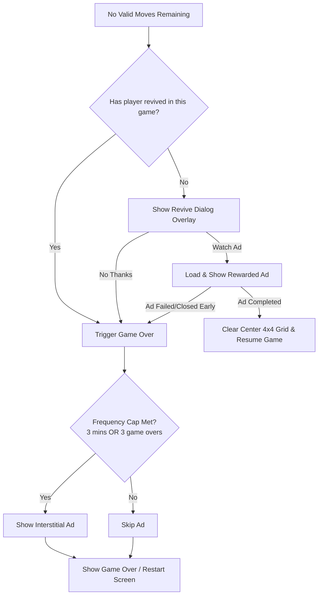

# AdMob Full-Screen Integration Plan (Interstitial & Rewarded Revive)

This document outlines the implementation strategy for integrating Google Mobile Ads **Interstitial Ads** (with frequency capping) and **Rewarded Ads** (for a once-per-game revive feature) in the Big Blue Blocks Flutter app.

---

## 1. Ad Unit Configuration

In `app/lib/services/ad_helper.dart`, define the test unit IDs (to be replaced with production IDs before release):

* **Android Interstitial**: `ca-app-pub-3940256099942544/1033173712`
* **iOS Interstitial**: `ca-app-pub-3940256099942544/4411468910`
* **Android Rewarded**: `ca-app-pub-3940256099942544/5224354917`
* **iOS Rewarded**: `ca-app-pub-3940256099942544/1712485313`

---

## 2. Ad Lifecycle Management in `main.dart`

To avoid latencies, both interstitial and rewarded ads must be preloaded in the background.

### Interstitial Ad Management
* Keep track of `InterstitialAd? _interstitialAd` and `bool _isInterstitialAdLoaded`.
* Implement `_loadInterstitialAd()` to query the Ad SDK.
* Enforce **Frequency Capping** using:
  * `DateTime? _lastInterstitialShowTime`
  * `int _gameOverCountSinceLastAd`
* An ad is only shown if `_lastInterstitialShowTime` is null, or at least **3 minutes** have elapsed since the last ad, or **3 game overs** have occurred since the last ad.

### Rewarded Ad Management
* Keep track of `RewardedAd? _rewardedAd` and `bool _isRewardedAdLoaded`.
* Implement `_loadRewardedAd()` to query the Ad SDK.
* Track `bool _hasRevivedThisGame` to restrict the player to a single revive per game session.

---

## 3. Game Over & Revive UX Flow

### Revive Dialog UI
When the board is locked and `_hasRevivedThisGame == false`, a custom overlay is displayed on top of the board:
* **"Watch Video to Revive"** Button (triggers Rewarded Ad).
* **"No Thanks"** Button (proceeds to standard Game Over).

### Revive Logic
If the reward is earned:
* Set `_hasRevivedThisGame = true`.
* Clear coordinates `x` and `y` from `2` to `5` (center 4x4 grid).
* Resume play state.
